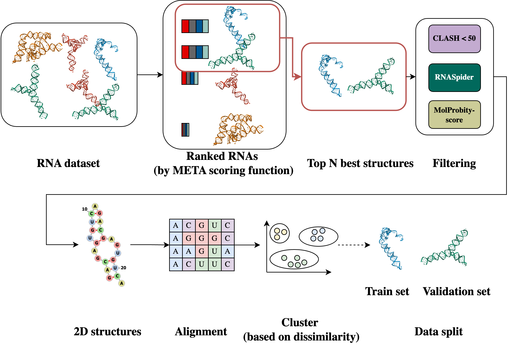

<!-- omit in toc -->
# RNA-SyntHub 🧬
<strong>Meta-scoring pipeline to prepare curated synthetic RNA structure data</strong>

RNA-SyntHub is a pipeline applied to create curated RNA structures data. 
It has been applied to a set of [447,402 synthetic RNA](https://www.kaggle.com/datasets/andrewfavor/uw-synthetic-rna-structures) structures 
and enforced by predictions from [RNAComposer](https://rnacomposer.cs.put.poznan.pl/) and [Boltz-1](https://github.com/jwohlwend/boltz). 
